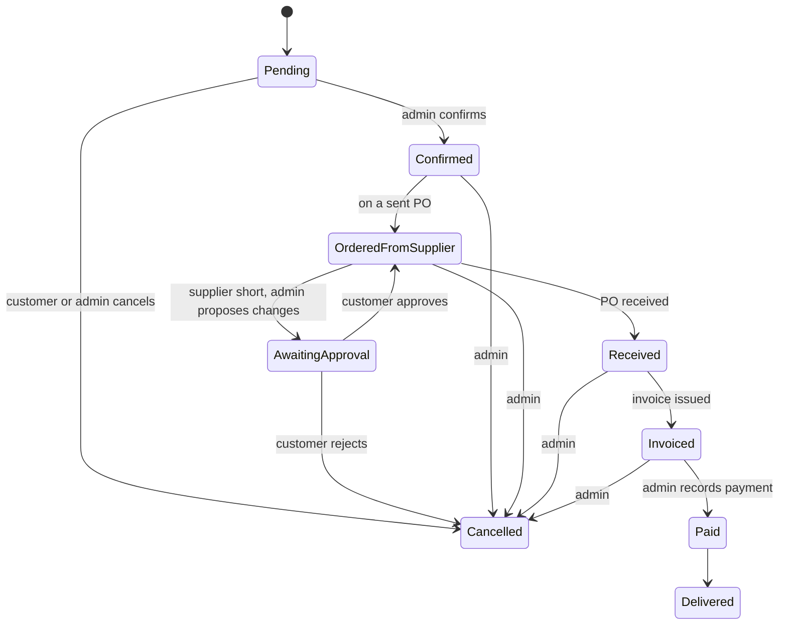

# W&S Engineering Store — Build Spec

Source of truth for product decisions. Living copy: https://claude.ai/code/artifact/7b3543d1-883f-453f-8025-b0fec53fcb8b
(this file was exported from it on 2026-09-28 and updated to match what has been built).

## Overview

W&S Engineering is building a mobile-first online store that sells Kraft Tool Co. products (including W. Rose, Sands Level, Gator Tools and Hi-Craft) as a reseller. Customers build a cart and place an **order request**; no payment is taken online. W&S orders from the supplier after the customer orders, then invoices only what arrived.

- **Stack:** Next.js (App Router) on Vercel, Supabase (Postgres, Auth, Storage, row-level security), Resend for transactional email.
- **Buyers:** retail customers, one public price. No trade tiers, promo codes or trade-quote flow in v1.
- **Source catalog:** Kraft Tool Co. Series 0126 PDF (196 pages, 14 sections, no prices).

## Catalog

One product per catalog item, with a variant per SKU chosen by option pickers. A Carbon Steel Five Star Pool Trowel is one product with 40 variants (CFE435PF, CFE435, CFE435L, CFE435K…) across Handle × Size × Shank.

- **Availability:** no stock quantities; nothing is held on hand. Each variant has `is_orderable` (false = discontinued: hidden, can't be added to cart).
- **Brand** is a product field and a filter, not a category. Four catalog sections are brands: Gator Tools, Hi-Craft, Sands Level, W. Rose.
- **Categories:** 6 parent groups; catalog sections become subcategories.

| Group | Catalog sections |
| --- | --- |
| Concrete | Flat Finishing Trowels, Concrete, Gator Tools |
| Masonry | Masonry, W. Rose |
| Drywall & Plaster | Drywall, Plaster and EIFS |
| Tile & Floor | Tile and Floor Covering |
| Levels & Measuring | Sands Level & Tool |
| General | General Contractor, Asphalt, Hi-Craft, Apprentice Kits |

Display Accessories (dealer fixtures) are excluded. Apparel is excluded for now (open question).

- **Seeded:** 955 products, 4,493 variants, 2,031 product images (905 products have ≥1 photo). 205 product names are flagged `needs_review`. See `data/variants_review.csv`.
- **Options vs specs:** a column that varies across a product's variants is an option (picker); a column with one value for all variants is stored in `products.specs`.
- **Dependent options:** some combinations don't exist (e.g. Size 16"x4" comes with Shank 7-7/8" or 13-5/8"). Pickers must only offer combinations that exist in `variants`.
- **Images:** auto-matched by page position. Admin reassigns wrong matches. Products without an image get a placeholder.
- **Featured:** admin sets `is_featured` (Best sellers), `is_new` (New arrivals) and `related_products` (Often bought together) manually.

## Pricing

Prices are in local currency, computed from a USD supplier cost that admin enters per variant as quotes come in.

```
price = price_override ?? round99(usd_cost × exchange_rate × (1 + markup_pct/100))
round99(x) = ceil((x + 1) / 100) × 100 − 1        e.g. 5,244.75 → 5,299
```

- **Settings:** one global `exchange_rate` and `markup_pct` (table `settings`, single row).
- **Override:** admin can set `price_override` per variant; it wins.
- **No cost yet → price is null:** show "Price on request". It can still be ordered and is priced at invoice.
- **Price lock:** each order line snapshots its unit price at order time. Invoices honor the snapshot.
- **Tax:** none.
- **Confidential:** `usd_cost` is never exposed to anon/authenticated. The public reads `variant_prices`. Admin code reads/writes cost server-side with the service-role key.

## Customer experience

Anyone can browse and build a cart; an account is required only to place an order.

- **Sign in:** email + password (Supabase Auth), with verification and password reset.
- **Cart:** guest cart in localStorage. On login it merges into the account cart, keeping the **higher** quantity per variant (not the sum).
- **Stale cart items:** prices update silently; discontinued variants drop out. Checkout re-validates every line server-side.
- **Checkout:** pickup or delivery; delivery needs an address, prefilled from the customer's last order. Button: **"Place order request"**. Total is labeled an **estimate** (delivery fee and "Price on request" lines are added at invoice).
- **Cancellation:** customer can cancel while Pending. After admin confirms, only admin can cancel. Cancel vs confirm is atomic (one wins).
- **Account area:** order history, status timeline, approve/reject proposed changes, invoice PDFs.

## Order workflow

An order is a request until goods arrive from the supplier; the invoice bills only what arrived.



- **Admin cancel:** any state before Paid.
- **Supplier shortage:** admin edits lines (remove, replace, change qty) → Awaiting approval. Customer approves/rejects in their account. Reminder email after 3 days; after that, admin decides. Nothing auto-cancels.
- **Purchase orders:** admin groups Confirmed order lines into a PO by SKU, one PO per supplier (Kraft Tool only at launch). Marking a PO received moves its orders to Received.
- **Invoice:** admin sets delivery fee (0 for pickup) and prices any "Price on request" lines. App generates a PDF and emails it. Admin records payment method + reference when marking Paid.
- **Emails (Resend):** order placed, confirmed, changes proposed, reminder, invoice, delivered / ready for pickup, cancelled. Admin alert on every new order.

## Admin panel

One admin at launch; `profiles.role` leaves room for staff.

- **Products:** edit name, description, features, specs, brand, category, images; reassign images; toggle variants orderable/discontinued; featured flags; related products; clear `needs_review`.
- **Pricing:** exchange rate + markup; USD cost per variant; price override; **bulk cost entry** (filter e.g. SKU prefix `CFE` and paste values); list of variants still "Price on request".
- **Orders:** list by status, confirm, cancel, propose line changes, delivery fee, generate invoice, record payment, mark delivered.
- **Purchase orders:** build from Confirmed lines grouped by SKU, export (CSV), mark sent and received.
- **Audit log:** every status change, line edit and price edit: who, when, before, after. Customers see a status timeline only.

## Design

The W&S Engineering wireframes (`docs/design/wireframes.html`, open in a browser) set the brand. Keep their look; adapt to this spec, mobile-first.

| Token | Value |
| --- | --- |
| Navy (primary, header) | #13204a |
| Cream (background) | #fbf8f1 / #f6efe0 |
| Gold (accents, badges) | #b8894a / #dcbf8f |
| Headings | EB Garamond |
| Body | IBM Plex Sans |
| SKUs, labels | IBM Plex Mono |
| Wordmark | Yellowtail |

Wireframe screens: home (hero, category tiles, best sellers), category list (filter pills, sort), product page, cart page, cart drawer, ⌘K search palette, mega menu, add-to-cart toast.

**Changes to the wireframes**

- Product page gets option pickers (Size, Handle, …); SKU and price update per selection; impossible combinations disabled.
- Stock badges, "only X left" and the In-stock filter become Available / Price on request.
- Cart drops the promo code field, the trade-quote link and the free-shipping line. "Checkout" → "Place order request" with an estimate note.
- Hero copy rewritten: W&S as an authorized reseller of Kraft Tool and W. Rose, not a maker ("built in our own workshop" must go).
- Category tiles and mega menu use the 6 groups; subcategories inside.
- Currency formatting and price filter ranges in local currency (no cents).

**Mobile-first**

- Quick-add button always visible (no hover). Mega menu → tap-open category sheet.
- ⌘K palette → full-screen search from a search icon (keep ⌘K on desktop). Cart drawer → bottom sheet.
- Filter pills scroll sideways. Category tiles 6 columns → 2. Large tap targets on option pickers.

**New screens, same style:** sign in / sign up, checkout, order confirmation, order history + detail, approve changes, invoice view. Admin screens use the same tokens, plain and dense.

## Data model

Row-level security everywhere: public reads the catalog; customers read/write only their own carts and orders; admin writes everything.

**Built (`supabase/migrations/0001_catalog.sql`, `0002_storage.sql`):**

| Table | Key columns |
| --- | --- |
| profiles | id (auth user), full_name, phone, role (customer, admin) |
| suppliers | id, name |
| category_groups | id, name, slug, sort |
| categories | id, group_id, name, slug, sort, catalog_pages |
| brands | id, name, slug |
| products | id, slug, name, category_id, brand_id, supplier_id, description, features (jsonb array), specs (jsonb), catalog_page, is_featured, is_new, needs_review |
| product_options | id, product_id, name, sort, values (text[]) |
| variants | id, product_id, sku (unique), option_values (jsonb), usd_cost, price_override, is_orderable, sort |
| product_images | id, product_id, variant_id (nullable), storage_path (in bucket `product-images`), sort |
| related_products | product_id, related_id |
| settings | id = 1, exchange_rate, markup_pct |
| view variant_prices | id, product_id, sku, option_values, is_orderable, sort, price |

Helpers: `is_admin()`, `round99()`. Storage bucket `product-images` is public-read, admin-write.

**To build (migration 0003+):**

| Table | Key columns |
| --- | --- |
| cart_items (0003) | user_id, variant_id, qty |
| orders | id, number, user_id, status, fulfillment (pickup, delivery), address, delivery_fee, estimate_total, invoice_total, payment_method, payment_ref, timestamps |
| order_lines | order_id, variant_id, sku, name, option_values, qty, unit_price (snapshot, nullable) |
| order_changes | order_id, proposed lines (jsonb), status (proposed, approved, rejected), reminded_at |
| order_events | order_id, status, actor_id, created_at (customer-visible timeline) |
| purchase_orders / po_lines | supplier_id, status (draft, sent, received); variant_id, qty, order_line_ids |
| invoices | order_id, number, pdf_path, issued_at |
| audit_log | actor_id, entity, entity_id, action, before, after, created_at |

Status changes go through Postgres functions (`security definer`) so transitions are validated and cancel-vs-confirm races are atomic.

## Build order

1. ✅ Supabase catalog schema, RLS, admin role, price view.
2. ✅ PDF extraction and seed: products, variants, images.
3. ✅ Storefront, mobile-first: home, category list, product page with option pickers, search, guest cart.
4. ✅ Auth, cart merge, checkout, order placement (migration 0003 — apply to hosted).
5. Admin: products, pricing, bulk cost entry.
6. Order workflow: statuses, change proposals and approval, purchase orders.
7. PDF invoices and Resend emails.

## Risks

- Extraction is imperfect: 205 names need review; ~5–10% of catalog SKUs were missed (mostly the power-trowel blade cross-reference, pp. 46–47, and a few odd layouts, pp. 61, 138). Some extra images belong to neighbours.
- Kraft Tool and W. Rose names and catalog photos: confirm reseller terms allow using them.
- Orders are placed without a final total. The UI must say so clearly.
- Most variants start as "Price on request" until supplier costs arrive.

## Open items

- [ ] Store contact details, pickup location and hours
- [ ] Starting exchange rate and markup %
- [x] Order number format: `WS-1001`, `WS-1002`, … (invoice number format still open)
- [ ] Domain name and sender email for Resend
- [ ] Apparel: sell it (enter by hand) or drop it
